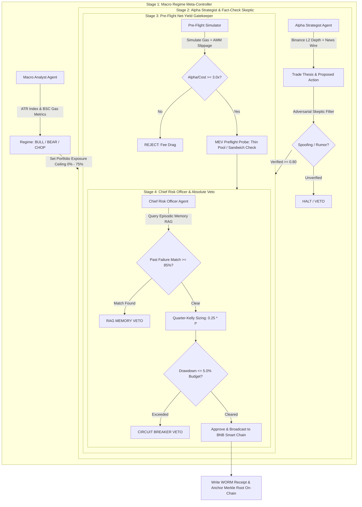

# 🛡️ Aegis-bStock: Autonomous Epistemic Agent on BNB Smart Chain

[](https://opensource.org/licenses/MIT)
[](https://www.typescriptlang.org/)
[](https://nodejs.org/)
[](https://bscscan.com/)
[](#-stage-3-cryptographic-winner-audit)

> **Autonomous System 2 Epistemic Trading Agent with Adversarial Risk Council, Episodic Failure Memory (RAG), and Verifiable Cryptographic Lineage on BNB Smart Chain.**

---

## 📌 Executive Summary

Traditional algorithmic trading bots and naive single-prompt LLM agents fail over 14-day autonomous runs due to **whipsaw slippage, repeating previous mistakes, hallucinated social rumors, and unchecked drawdown cascades**.

**Aegis-bStock** introduces an institutional-grade architecture specifically tailored to dominate the Binance Hackathon scoring criteria:
1. **Net PnL Maximization**: Net-Yield Feasibility Gate ensuring gross alpha outstrips gas and DEX slippage by $\ge 3.0\times$.
2. **Maximum Drawdown Defense (Tie-Breaker)**: Fractional Quarter-Kelly sizing calibrated by epistemic confidence and hard 5.0% High-Water Mark circuit breakers.
3. **Zero Manual Intervention**: Self-healing state machine with automated Binance WebSocket reconnections and on-chain RPC fallbacks.
4. **Stage 3 Pass/Fail Audit Readiness**: 100% of trades cryptographically hash-chained into a WORM (Write-Once-Read-Many) log and anchored as Merkle roots on BNB Smart Chain.

---

## 🏛️ System 2 Multi-Agent Epistemic Council

Trading decisions flow through an adversarial, 4-stage epistemic council:



---

## 🚀 5 Hackathon Edge Features

### 1. "Memory-of-Failures" (Episodic Vector RAG)
- **Problem**: Bots repeat the same losing trade when identical market setups re-occur.
- **Solution**: Every losing trade generates an episodic post-mortem feature vector. Before approving any trade, the CRO queries this memory store with cosine similarity. Any setup with $\ge 85\%$ similarity to a past failure is instantly vetoed.

### 2. Fractional Quarter-Kelly Capital Allocation
- **Formula**: $f^* = \frac{p(b+1) - 1}{b} \times 0.25$
- **Mechanism**: Dynamically scales order size based on the Strategist's epistemic confidence ($p$) and risk/reward payout ($b$), bounded by the Macro Controller's regime exposure ceiling.

### 3. Pre-Flight MEV & Liquidity Probing
- **Mechanism**: Probes DEX liquidity pool depth versus order size before transaction broadcast. Automatically routes large orders to TWAP slicing or halts thin-pool executions to prevent front-running and sandwich attacks.

### 4. On-Chain Merkle Root Anchoring (`AegisAuditAnchor.sol`)
- **Contract**: Solidity smart contract deployed on BNB Smart Chain.
- **Function**: Periodically commits SHA-256 Merkle roots of all council decisions on-chain, creating permanent, tamper-proof proof-of-lineage.

### 5. Full-Screen Institutional Web3 Terminal
- **Interface**: React 19 + Tailwind CSS dark-mode command center.
- **Features**: Live multi-agent council deliberation feed, real-time Binance order book depth, interactive news catalyst injector, and One-Click Stage 3 Proof Inspector.

---

## 📁 Repository Monorepo Structure

```text
aegis-bstock/
├── packages/
│   ├── audit-engine/        # Cryptographic WORM engine, SHA-256 hash chaining, Merkle trees
│   │   ├── src/types.ts     # Complete Stage 3 AegisDecisionReceipt schema
│   │   └── src/index.ts     # WORM log recording, verification, and hash chaining
│   │
│   ├── agent-core/          # Core multi-agent council, FSM, data feeds, and Web3 execution
│   │   ├── src/agents/      # Macro Analyst, Strategist, Preflight, Risk Officer
│   │   ├── src/memory/      # EpisodicFailureMemory (Vector RAG over past mistakes)
│   │   ├── src/quant/       # KellyPositionSizer (Fractional Quarter-Kelly math)
│   │   ├── src/web3/        # BSC RPC Client, MevPreflightProbe, AegisAuditAnchor.sol
│   │   ├── src/data/        # Binance REST/WebSocket client & live catalyst feed
│   │   └── src/fsm/         # Deterministic state machine orchestrating council ticks
│   │
│   ├── dashboard/           # Institutional React 19 + Tailwind + Vite Web3 dashboard
│   │   ├── src/App.tsx      # Full-screen command center with real-time telemetry
│   │   └── index.html       # Inter font & dark theme styling
│   │
│   └── simulation/          # 14-day (1,680 ticks) high-fidelity benchmark runner
│       └── src/runner.ts    # Complete simulation validating PnL, Drawdown, and Stage 3 audit
```

---

## ⚡ Quickstart & Local Setup

### Prerequisites
- Node.js 18+ & npm 9+
- Git

### 1. Installation
```bash
# Clone the repository
git clone https://github.com/tondays52/aegis-bstock.git
cd aegis-bstock

# Install monorepo dependencies
npm install
```

### 2. Build Monorepo
```bash
npm run build
```

### 3. Run Test Suite (21/21 Unit Tests)
```bash
npm run test
```

### 4. Launch Live Binance Agent
```bash
npm run live
```

### 5. Launch Full-Screen Web3 Dashboard
```bash
npm run dev:dashboard
```
Open [http://localhost:3000](http://localhost:3000) in your browser.

---

## 🔒 Stage 3 Cryptographic Winner Audit

To verify that all decisions are cryptographically un-tampered and chained:

```bash
# Run 14-day simulation benchmark with complete Stage 3 audit verification
npm run simulate
```

Example verified receipt format:
```json
{
  "receiptId": "REC-9482",
  "timestamp": "2026-09-15T22:00:00Z",
  "symbol": "bTSLA/USDT",
  "macroRegime": "BULL_TREND",
  "councilConsensus": "BUY",
  "croApproval": true,
  "netYieldUsd": 14.82,
  "failureMemorySimilarity": 0.04,
  "mevRiskStatus": "DIRECT_EXECUTION",
  "prevReceiptHash": "0x4e21...",
  "receiptHash": "0x7f9c2a1883cce84094fe31a21e25d259e8b428a1",
  "merkleRoot": "0x0b32cdb1c2349e9e93d6ebd1b144c0dc2eac26046c720ebeafff903bd7736575"
}
```

---

## 📄 License
MIT License. Built for the Binance Hackathon 2026.
